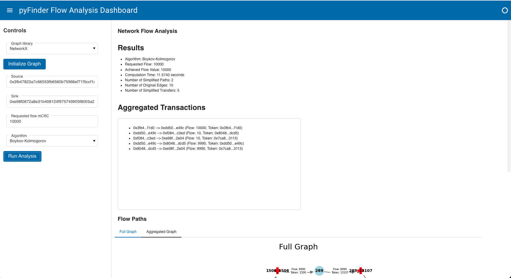
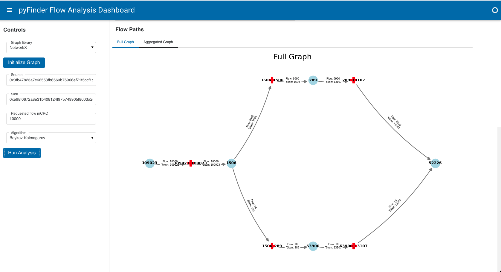
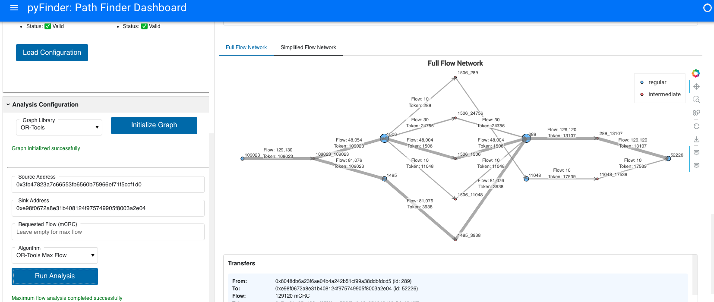
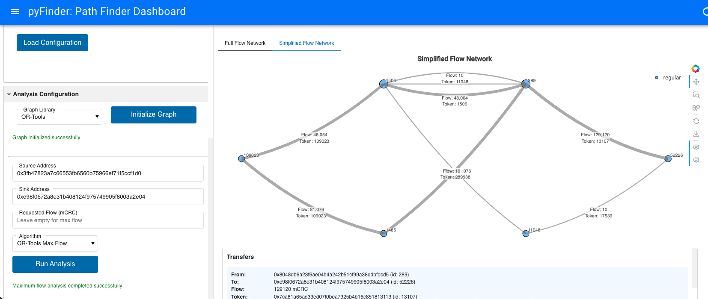

# PyFinder


This project provides the Python implementation of the Pathfinder tool for the Circles UBI project. It includes network flow algorithms and tools to analyze and visualize the flow of value through a network of trust-based connections, facilitating the understanding and optimization of value transfers in the Circles UBI ecosystem.

## Table of Contents
1. [Methodology](#methodology)
2. [Installation](#installation)
3. [Usage](#usage)
4. [Project Structure](#project-structure)
5. [Class Descriptions](#class-descriptions)
6. [Running the Script](#running-the-script)
7. [Examples](#examples)
8. [Dashboard](#dashboard)

## Methodology

### Data Sources

The graph is constructed using two primary data sources:

1. **Trusts**: This dataset defines which tokens each account trusts and is willing to accept.
2. **Balances**: This dataset shows the token balances held by each account.

### Graph Construction

For each account (referred to as the "truster"), we follow these steps:

1. Identify all tokens trusted by the account.
2. Find all other accounts holding any of these trusted tokens.
3. Create edges from these token-holding accounts to the truster.
4. Each edge represents a potential flow of a specific token from the holder to the truster.

This process is repeated for all accounts, resulting in a complex, multi-directed graph.

### Challenge with Direct Representation

In a naive implementation, each edge's capacity would be set to the token balance held by the sender. However, this approach presents a problem: if a sender has multiple edges for the same token (connecting to different trusters), it could lead to "balance non-conservation." This occurs because standard flow algorithms are not aware of the need to conserve total balance across multiple edges.


For example, if account A holds 100 units of token B and can send to both accounts C and D, a naive implementation might allow a total flow of 200 units (100 to C and 100 to D), which violates the actual balance constraint.

### Solution: Intermediate Nodes

To enforce balance conservation, we introduce intermediate nodes:

1. For each unique combination of sender and token, we create an intermediate node.
2. Instead of direct edges from sender to trusters, we now have:
   - An edge from the sender to the intermediate node
   - Edges from the intermediate node to each truster accepting that token

For example:
- If A can send token B to both C and D:
  1. We create an intermediate node A_B
  2. We add an edge from A to A_B with capacity equal to A's balance of token B
  3. We add edges from A_B to C and from A_B to D

This structure ensures:
- The total outflow of token B from A is limited to its actual balance
- A_B acts as a "gate," enforcing the balance constraint
- The flow to C and D can be any combination, as long as their sum doesn't exceed A's balance of token B

By using this intermediate node structure, we automatically enforce balance conservation without needing to modify standard flow algorithms.


For an actual implementation take the case take the requested Flow of 129130 mCRC from node 109023 to node 52226. The full graph implementation gives 


Which can the be simplified to


## Installation

1. Clone the repository:
```bash
git clone https://github.com/hdser/pyfinder.git
cd pyfinder
```

2. Install dependencies using conda:
```bash
conda env create -f environment.yml
conda activate pyfinder
```

3. Run dashboard:
```bash
python run.py
```

Or run dashboard with docker:
```bash
docker compose up
```

## Usage

PyFinder provides three main interfaces for analysis:

### 1. Interactive Dashboard (run.py)

The dashboard offers a web-based interface for interactive analysis. Launch options:

```bash
# Direct Python launch
python run.py

# Docker Compose launch
docker compose up

# Manual Docker launch
docker build -t pyfinder .
docker run -p 5006:5006 pyfinder
```

Configuration:
```python
# Default settings in run.py
port = int(os.getenv('PORT', '5006'))
host = os.getenv('HOST', '0.0.0.0')
websocket_max_size = int(os.getenv('BOKEH_WEBSOCKET_MAX_MESSAGE_SIZE', 20*1024*1024))
```

### 2. Command Line Analysis (main.py)

The CLI tool provides two operation modes:

#### Analysis Mode
```bash
python -m src.main \
    --trust-file data/trust.csv \
    --balance-file data/balance.csv \
    --implementation networkx \
    --source 0x3fb47823a7c66553fb6560b75966ef71f5ccf1d0 \
    --sink 0xe98f0672a8e31b408124f975749905f8003a2e04
```

Available implementations:
- networkx (Python-based, full algorithm support)
- graph-tool (C++-based, high performance)
- ortools (Industrial solver)

#### Benchmark Mode
```bash
python -m src.main --benchmark \
    --implementations networkx,graph_tool \
    --output-dir benchmarks
```

### 3. Arbitrage Analysis (arb.py)

Specialized tool for detecting arbitrage opportunities:

```bash
python arb.py \
    --trust-file data/trust.csv \
    --balance-file data/balance.csv \
    --implementation graph_tool \
    --source 0x3fb47823a7c66553fb6560b75966ef71f5ccf1d0 \
    --start-token 0xe98f0672a8e31b408124f975749905f8003a2e04 \
    --end-token 0x123...
```

## Project Structure

```
pyfinder/
├── src/                            # Core implementation
│   ├── graph/                      # Graph implementations
│   │   ├── base.py                 # Abstract base classes
│   │   ├── networkx_graph.py
│   │   ├── graphtool_graph.py
│   │   └── ortools_graph.py
│   |   └── flow/                   # Flow algorithms
│   │       ├── analysis.py         # Flow analysis
│   │       ├── decomposition.py
│   │       └── utils.py
│   ├── visualization.py            # Visualization tools
│   ├── data_ingestion.py           # Data loading
│   └── graph_manager.py            # Orchestration
├── dashboard/                      # Web interface
│   ├── components/                 # UI components
│   └── visualization/              # Interactive viz
├── data/                           # Input data
└── output/                         # Analysis results
```

## Class Descriptions

### GraphManager

Core orchestration class that coordinates analysis:

```python
from src.graph_manager import GraphManager

# Initialize with CSV data
manager = GraphManager(
    data_source=("data/trust.csv", "data/balance.csv"),
    graph_type="networkx"
)

# Analyze flow
results = manager.analyze_flow(
    source="0x3fb4...",
    sink="0xe98f...",
    flow_func=None,  # Use default algorithm
    requested_flow="4000000000000000000"
)

# Unpack results
flow_value, paths, simplified_flows, original_flows = results
```

### DataIngestion

Handles data loading and preprocessing:

```python
from src.data_ingestion import DataIngestion
import pandas as pd

# Load data
df_trusts = pd.read_csv("data/trust.csv")
df_balances = pd.read_csv("data/balance.csv")

# Initialize ingestion
data = DataIngestion(df_trusts, df_balances)

# Access mappings
node_id = data.get_id_for_address("0x3fb4...")
address = data.get_address_for_id("42")
```

### NetworkXGraph / GraphToolGraph

Graph implementation wrappers:

```python
from src.graph import NetworkXGraph

# Create graph
graph = NetworkXGraph(edges, capacities, tokens)

# Compute flow
flow_value, flow_dict = graph.compute_flow(
    source="42",
    sink="318",
    flow_func=nx.algorithms.flow.preflow_push
)

# Decompose into paths
paths, edge_flows = graph.flow_decomposition(
    flow_dict, "42", "318"
)
```

### NetworkFlowAnalysis

Handles core flow computations:

```python
from src.flow.analysis import NetworkFlowAnalysis

# Initialize analyzer
analyzer = NetworkFlowAnalysis(graph)

# Analyze flow
flow_value, paths, simplified_flows, original_flows = analyzer.analyze_flow(
    source="42",
    sink="318",
    flow_func=None,
    requested_flow="4000000000000000000"
)
```

### Visualization

Creates analysis visualizations:

```python
from src.visualization import Visualization

# Initialize visualizer
viz = Visualization()

# Create path visualization
viz.plot_flow_paths(
    graph,
    paths,
    simplified_flows,
    id_to_address,
    "output/paths.png"
)

# Create full graph visualization
viz.plot_full_flow_paths(
    graph,
    original_flows,
    id_to_address,
    "output/full_graph.png"
)
```

## Running the Script

### 1. Data Preparation

Place data files in the `data/` directory:
```
data/
├── trust.csv          # Trust relationships
└── balance.csv        # Account balances
```

Required CSV formats:
```python
# trust.csv
trustee,truster
0x3fb4...,0xe98f...

# balance.csv
account,tokenAddress,demurragedTotalBalance
0x3fb4...,0xe98f...,4000000000000000000
```

### 2. Analysis Execution

Run the analysis:
```bash
python -m src.main
```

Select mode when prompted:
```
Choose mode:
1. Run Mode (analyze specific flow)
2. Benchmark Mode (compare algorithms)

Enter choice (1-2):
```

### 3. Analysis Configuration

For Run Mode, enter:
- Source address (42-char hex)
- Sink address (42-char hex)
- Flow amount (optional)
- Algorithm choice:
  1. Preflow Push (default)
  2. Edmonds-Karp
  3. Shortest Augmenting Path
  4. Boykov-Kolmogorov
  5. Dinitz

### 4. Results Analysis

The script produces:
1. Console output:
   - Flow value
   - Computation time
   - Path details
   - Performance metrics

2. Visualization files:
   - `output/simplified_paths.png`
   - `output/full_paths.png`
   - `output/metrics.csv`

## Examples

### 1. Basic Flow Analysis

```python
from src.graph_manager import GraphManager

# Initialize manager
manager = GraphManager(
    data_source=("data/trust.csv", "data/balance.csv"),
    graph_type="networkx"
)

# Analyze maximum flow
results = manager.analyze_flow(
    source="0x3fb47823a7c66553fb6560b75966ef71f5ccf1d0",
    sink="0xe98f0672a8e31b408124f975749905f8003a2e04"
)

# Process results
flow_value, paths, simplified_flows, original_flows = results

print(f"Maximum flow: {flow_value}")
for path, tokens, flow in paths:
    print("\nPath:")
    print(f"Nodes: {' -> '.join(path)}")
    print(f"Tokens: {' -> '.join(tokens)}")
    print(f"Flow: {flow}")
```

### 2. Arbitrage Detection

```python
# Initialize with graph-tool for performance
manager = GraphManager(
    data_source=("data/trust.csv", "data/balance.csv"),
    graph_type="graph_tool"
)

# Find arbitrage opportunities
flow_value, paths, flows = manager.analyze_arbitrage(
    source="0x3fb47823a7c66553fb6560b75966ef71f5ccf1d0",
    start_token="0xe98f0672a8e31b408124f975749905f8003a2e04",
    end_token="0x123..."
)

if flow_value > 0:
    print(f"\nFound arbitrage: {flow_value} mCRC")
    for path, tokens, amount in paths:
        print(f"\nPath: {' -> '.join(path)}")
        print(f"Token conversions: {' -> '.join(tokens)}")
        print(f"Amount: {amount} mCRC")
```

### 3. Performance Benchmarking

```python
import time
from src.graph_manager import GraphManager

implementations = ["networkx", "graph_tool", "ortools"]
results = []

for impl in implementations:
    manager = GraphManager(
        data_source=("data/trust.csv", "data/balance.csv"),
        graph_type=impl
    )
    
    start_time = time.time()
    flow_value, _, _, _ = manager.analyze_flow(
        source="0x3fb47823a7c66553fb6560b75966ef71f5ccf1d0",
        sink="0xe98f0672a8e31b408124f975749905f8003a2e04"
    )
    duration = time.time() - start_time
    
    results.append({
        "implementation": impl,
        "flow_value": flow_value,
        "computation_time": duration
    })

for result in results:
    print(f"\n{result['implementation']}:")
    print(f"Flow: {result['flow_value']}")
    print(f"Time: {result['computation_time']:.4f}s")
```

## Dashboard

   

The dashboard provides an interactive web interface for analysis:

### Components

1. Data Source Configuration
   - File upload
   - PostgreSQL connection
   - Environment configuration

2. Analysis Controls
   - Source/sink selection
   - Algorithm choice
   - Flow amount input

3. Visualization Panels
   - Network overview
   - Path visualization
   - Flow metrics

4. Results Display
   - Flow statistics
   - Path breakdown
   - Transaction list

### Launch Options

1. Direct Python:
```bash
python run.py
```

2. Docker Compose:
```bash
docker compose up
```

3. Manual Docker:
```bash
docker build -t pyfinder .
docker run -p 5006:5006 pyfinder
```

Access the dashboard at `http://localhost:5006`

## License

This project is licensed under the MIT License - see the [LICENSE](LICENSE) file for details.