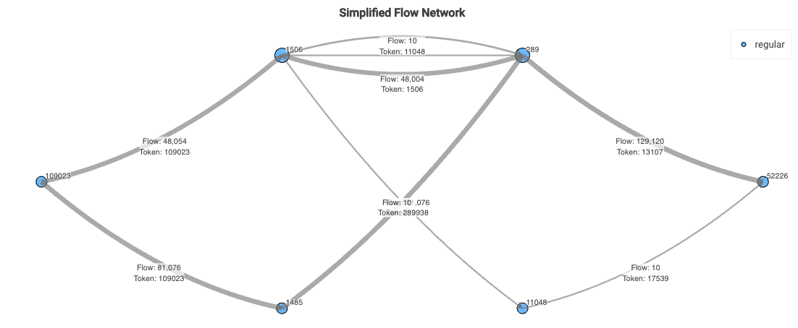
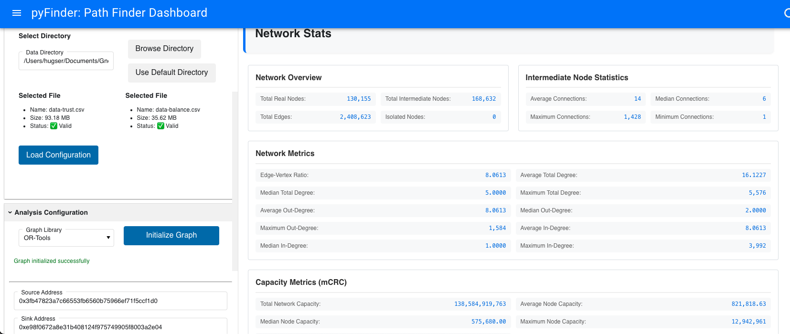
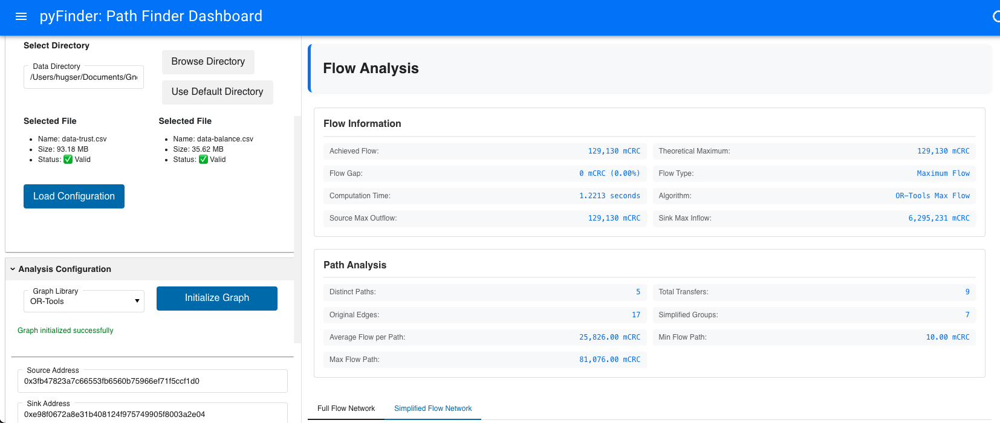

# PyFinder


This project provides the Python implementation of the Pathfinder tool for the Circles UBI project. It includes network flow algorithms and tools to analyze and visualize the flow of value through a network of trust-based connections, facilitating the understanding and optimization of value transfers in the Circles UBI ecosystem.

## Table of Contents
1. [Methodology](#methodology)
2. [Installation](#installation)
3. [Usage](#usage)
4. [Project Structure](#project-structure)
5. [Class Descriptions](#class-descriptions)
6. [Running the Script](#running-the-script)
7. [Examples](#examples)
8. [Dashboard](#dashboard)

## Methodology

### Data Sources

The graph is constructed using two primary data sources:

1. **Trusts**: This dataset defines which tokens each account trusts and is willing to accept.
2. **Balances**: This dataset shows the token balances held by each account.

### Graph Construction

For each account (referred to as the "truster"), we follow these steps:

1. Identify all tokens trusted by the account.
2. Find all other accounts holding any of these trusted tokens.
3. Create edges from these token-holding accounts to the truster.
4. Each edge represents a potential flow of a specific token from the holder to the truster.

This process is repeated for all accounts, resulting in a complex, multi-directed graph.

### Challenge with Direct Representation

In a naive implementation, each edge's capacity would be set to the token balance held by the sender. However, this approach presents a problem: if a sender has multiple edges for the same token (connecting to different trusters), it could lead to "balance non-conservation." This occurs because standard flow algorithms are not aware of the need to conserve total balance across multiple edges.


For example, if account A holds 100 units of token B and can send to both accounts C and D, a naive implementation might allow a total flow of 200 units (100 to C and 100 to D), which violates the actual balance constraint.

### Solution: Intermediate Nodes

To enforce balance conservation, we introduce intermediate nodes:

1. For each unique combination of sender and token, we create an intermediate node.
2. Instead of direct edges from sender to trusters, we now have:
   - An edge from the sender to the intermediate node
   - Edges from the intermediate node to each truster accepting that token

For example:
- If A can send token B to both C and D:
  1. We create an intermediate node A_B
  2. We add an edge from A to A_B with capacity equal to A's balance of token B
  3. We add edges from A_B to C and from A_B to D

This structure ensures:
- The total outflow of token B from A is limited to its actual balance
- A_B acts as a "gate," enforcing the balance constraint
- The flow to C and D can be any combination, as long as their sum doesn't exceed A's balance of token B

By using this intermediate node structure, we automatically enforce balance conservation without needing to modify standard flow algorithms.


For an actual implementation take the case take the requested Flow of 4000000000000000000 from node 9 to node 318. The full graph implementation gives 


Which can the be simplified to



## Installation

1. Clone the repository:
   ```
   git clone https://github.com/hdser/pyfinder.git
   cd pyfinder
   ```

2. Install dependencies:
   ```
   pip install -r requirements.txt
   ```

## Usage

The main script `main.py` provides two modes of operation:
1. Run Mode: Analyze flow between specific source and sink nodes.
2. Benchmark Mode: Compare performance of different flow algorithms.

To run the script:
```
python -m src.main
```

## Project Structure

- `src/`: Contains the main project modules
  - `data_ingestion.py`: Handles data loading and preprocessing
  - `graph_creation.py`: Creates and manages the network graph
  - `flow_analysis.py`: Implements flow analysis algorithms
  - `visualization.py`: Provides graph visualization functions
  - `graph_manager.py`: Coordinates the overall flow analysis process
- `main.py`: The main script to run the analysis
- `data/`: Directory for input data files
- `output/`: Directory for output files and visualizations

## Class Descriptions

### Classes

1. **GraphManager**
   - Main class that orchestrates the flow analysis process.
   - Methods:
     - `__init__(self, trusts_file, balances_file, graph_type='networkx')`: Initializes the graph manager.
     - `analyze_flow(self, source, sink, flow_func, cutoff)`: Performs flow analysis between source and sink.
     - `visualize_flow(self, simplified_paths, simplified_edge_flows, original_edge_flows, output_dir)`: Generates visualizations of the flow.

2. **DataIngestion**
   - Handles data loading and preprocessing.
   - Methods:
     - `__init__(self, df_trusts, df_balances)`: Initializes with trust and balance data.
     - `_create_id_mappings(self)`: Creates mappings between addresses and internal IDs.
     - `_create_edge_data(self)`: Generates edge data for the graph.
     - `get_id_for_address(self, address)`: Retrieves internal ID for a given address.
     - `get_address_for_id(self, id)`: Retrieves address for a given internal ID.

3. **NetworkXGraph / GraphToolGraph**
   - Wrapper classes for graph libraries (NetworkX and graph-tool).
   - Methods:
     - `__init__(self, edges, capacities, tokens)`: Initializes the graph.
     - `compute_flow(self, source, sink, flow_func, requested_flow)`: Computes maximum flow.
     - `flow_decomposition(self, flow_dict, source, sink, requested_flow)`: Decomposes flow into paths.
     - `simplified_flow_decomposition(self, original_paths)`: Simplifies flow paths.

4. **NetworkFlowAnalysis**
   - Performs the core flow analysis.
   - Methods:
     - `analyze_flow(self, source, sink, flow_func, requested_flow)`: Main method for flow analysis.
     - `simplify_edge_flows(self, edge_flows)`: Simplifies edge flows for visualization.

5. **Visualization**
   - Handles the creation of visualizations.
   - Methods:
     - `plot_flow_paths(g, paths, edge_flows, id_to_address, filename)`: Plots simplified flow paths.
     - `plot_full_flow_paths(g, edge_flows, id_to_address, filename)`: Plots full flow paths.
     - `custom_flow_layout(G, source, sink)`: Creates a custom layout for flow graphs.

## Running the Script

1. Ensure your input data files are in the `data/` directory:
   - `circles_public_V_CrcV2_TrustRelations.csv`: Trust relationships data
   - `circles_public_V_CrcncesByAccountAndToken.csv`: Account balances data

2. Run the main script:
   ```
   python -m src.main
   ```

3. Choose a mode:
   - Enter `1` for Run Mode
   - Enter `2` for Benchmark Mode

4. Follow the prompts to input source and sink nodes, choose algorithms, etc.

5. View the results in the console and check the `output/` directory for visualizations and benchmark results.

### Features

1. **Graph Library Selection**: Choose between NetworkX and graph-tool for graph operations.
2. **Algorithm Selection**: Select from various maximum flow algorithms:
   - Default (Preflow Push)
   - Edmonds-Karp
   - Shortest Augmenting Path
   - Boykov-Kolmogorov
   - Dinitz
3. **Source and Sink Input**: Enter Ethereum addresses for source and sink nodes.
4. **Requested Flow**: Optionally specify a requested flow value.
5. **Results Display**: View detailed results of the flow analysis.
6. **Visualization**: Interactive graphs showing flow paths.

## Examples

### Run Mode Example

1. Run the script and choose Run Mode (option 1)
2. When prompted, enter:
   - Source node: `9`
   - Sink node: `318`
   - Requested flow: (press Enter for maximum flow)
3. Choose an algorithm (e.g., 1 for Default Preflow Push)
4. The script will output:
   - Flow value
   - Execution time
   - Paths and edge flows
5. Check the `output/` directory for visualizations:
   - `simplified_flow_paths.png`: Simplified flow paths
   - `full_flow_paths.png`: Full flow paths including intermediate nodes

### Benchmark Mode Example

1. Run the script and choose Benchmark Mode (option 2)
2. The script will run all algorithms for predefined source-sink pairs
3. View the benchmark results in the console
4. Check `output/benchmark_results.csv` for detailed results

## Dashboard

  

1. **Controls**: Input fields for source, sink, requested flow, and algorithm selection.
2. **Results**: Displays the computed flow value, execution time, and other key metrics.
3. **Transactions**: Shows a detailed list of transfers in the computed flow.
4. **Flow Path Graphs**: Two interactive visualizations side by side:
   - **Simplified Graph**: Displays a simplified version of the flow, hiding intermediate nodes.
   - **Aggregated Graph**: Presents an aggregated view of transfers between main nodes.

These visualizations provide different levels of detail, allowing users to analyze the flow from various perspectives.

To launch the dashboard, run:

```
python dashboard.py
```

This will start a local server, and you can access the dashboard through your web browser.


## License

This project is licensed under the MIT License - see the [LICENSE](LICENSE) file for details.
